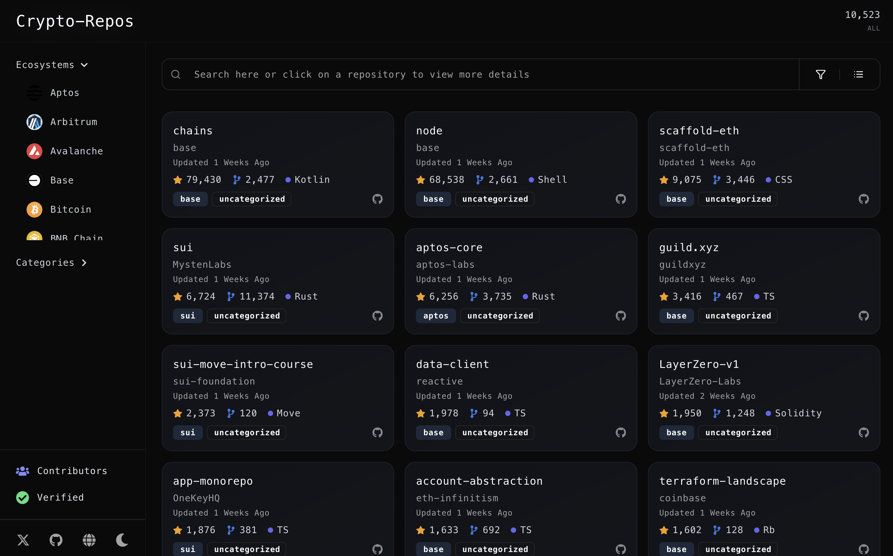
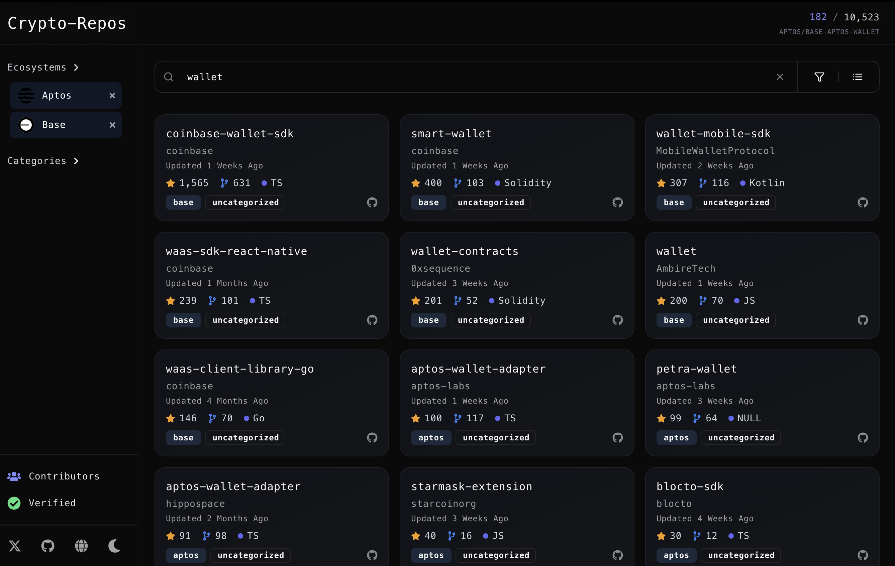
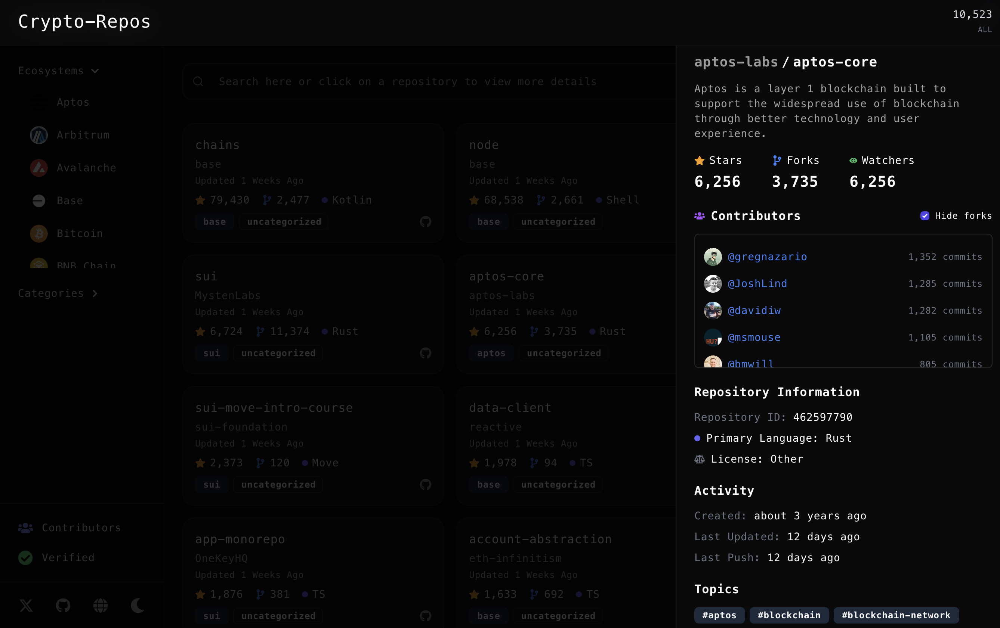
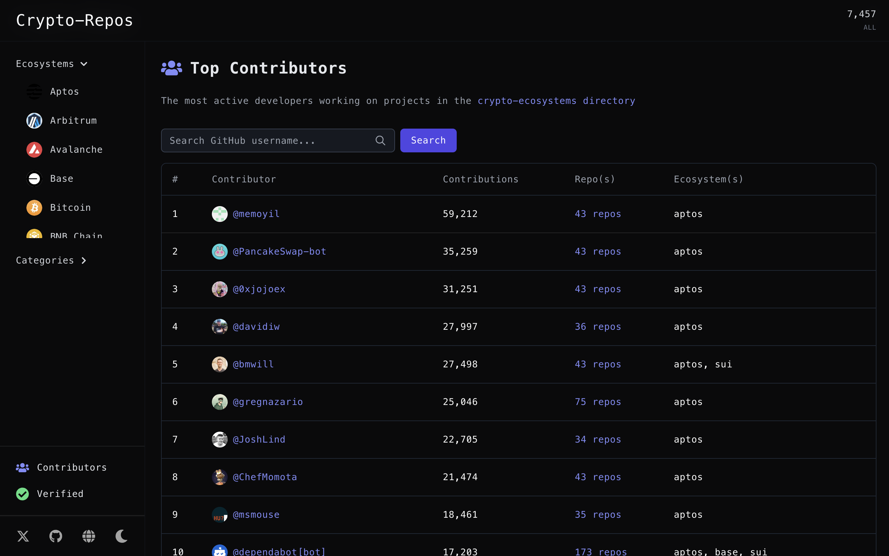
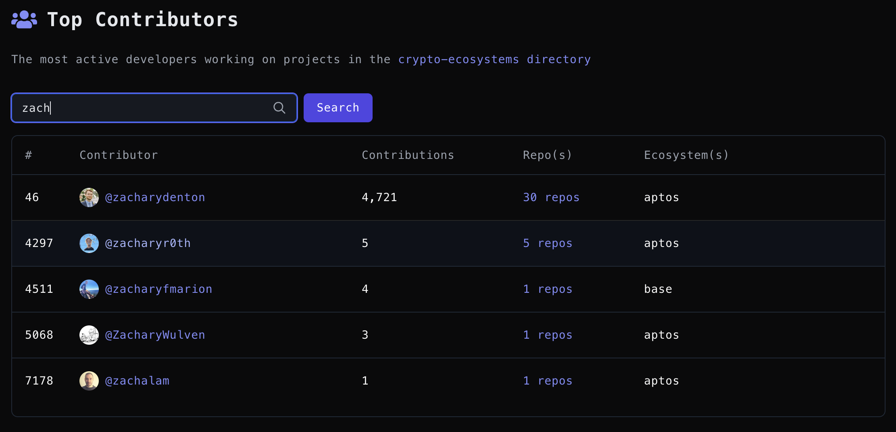

# Crypto-Repos: Open Source Blockchain Repository Explorer

A powerful platform for discovering, analyzing, and exploring open-source blockchain repositories across different ecosystems. Built with Next.js, TypeScript, and powered by Electric Capital's Crypto-Ecosystems directory. More context here.

## Key Features & Screenshots

### Repository Overview

Detailed view of repository metrics, contributions, and analytics


### Smart Repository Search

Advanced search capabilities across ecosystems and categories


### Repository Details

In-depth repository analysis with key metrics and insights


### Contributors Explorer

Track and analyze contributor activities across repositories


### Contributor Search

Find contributors across ecosystems and view their work


## Features

- Smart Search: Find repositories across ecosystems and categories
- Advanced Filtering: Filter by ecosystem, language, and license
- Real-time Updates: Live data synchronization with GitHub
- Developer Analytics: Track contributions and metrics
- Modern UI: Responsive design with dark/light mode
- Performance Optimized: Fast search with server-side rendering

## Tech Stack

- Frontend: Next.js, React, TypeScript, TailwindCSS
- Backend: Next.js API Routes, Vercel Postgres
- Data: PostgreSQL, Hasura
- Deployment: Vercel

## Local Development

1. Clone the repository:

```bash
git clone https://github.com/yourusername/crypto-repos.git
cd crypto-repos
```

2. Install dependencies:

```bash
npm install
```

3. Set up environment variables:

```bash
cp .env.example .env.local
# Edit .env.local with your credentials
```

4. Start the development server:

```bash
npm run dev
```

5. Open [http://localhost:3000](http://localhost:3000)

## Database Schema

Main tables:

- repositories: Core repository information
- repository_contributors: Contributor details
- repository_topics: Repository tags and categories

See [SCHEMA.md](lib/db/SCHEMA.md) for complete documentation.

## Search Features

- Full-text search across names and descriptions
- Ecosystem-specific filtering
- Language and license filtering
- Advanced sorting and pagination

## Contributing

1. Fork the repository
2. Create your feature branch
3. Commit your changes
4. Push to the branch
5. Open a Pull Request

## License

MIT License - see [LICENSE](LICENSE) file

## Links

- Website: https://crypto-repos.com
- Documentation: https://docs.crypto-repos.com
- Twitter: https://twitter.com/cryptorepos
- Discord: https://discord.gg/cryptorepos

## 🙏 Acknowledgments

- [Electric Capital](https://electriccapital.com/) for the Crypto-Ecosystems directory
- The open-source blockchain community
